ESPHome on Home Assistant
=======================
.. note::
  ESP32 C3 on ESPHome is currently in development, so you need to install the dev version of it.

Install Home Assistant
----------------------

Home Assistant is a greate local IoT Platform which connect different devices and services together. You can install it on your own computer or Raspberry Pi which is recommended. To install Home Assistant, you need to install and setup Home Assistant, go to https://www.home-assistant.io/.

Install ESPHome
----------------
1. After installing Home Assistant, you can install ESPHome on your Home Assistant. Open your home assistant page, which normally http://homeassistant.local:8123/. Go through :guilabel:`Configuration` => :guilabel:`Add-ons, Backups & Supervisor`

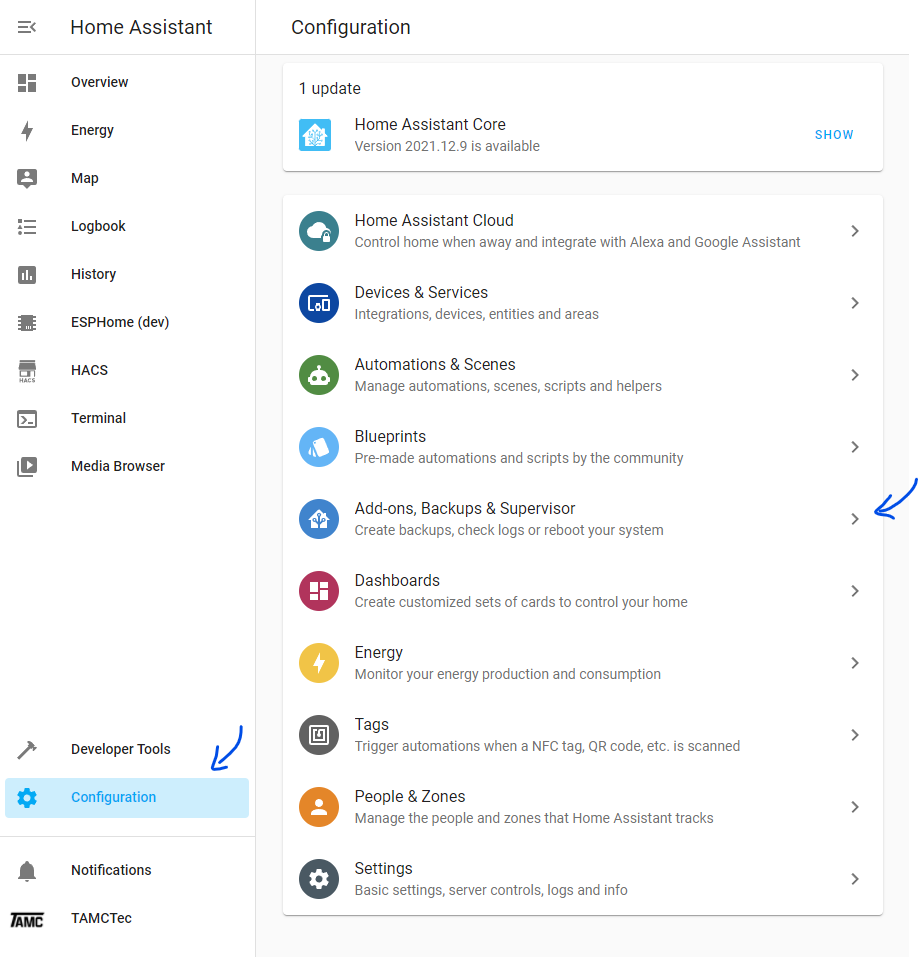

2. Click on the right bottom :guilabel:`ADD_ON STORE` button.

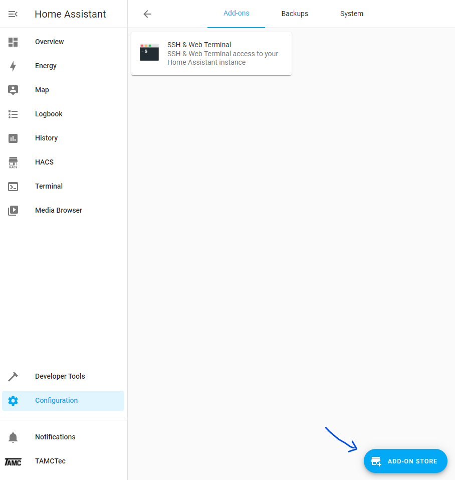

3. Click on the top right three dots. Then click on :guilabel:`Reposotories`.

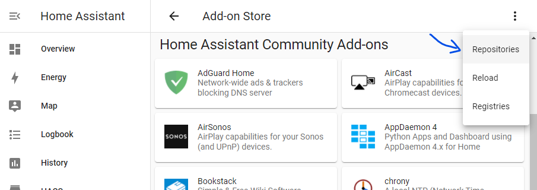

4. Paste in the esphome repo url: ``https://github.com/esphome/hassio`` and click :guilabel:`Add`.

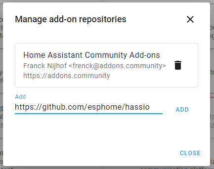

.. note::
  Do not install it from :guilabel:`Home Assistant Community Add-ons` which is the release version.
5. After repository added, go back the add on store, you should see a category called :guilabel:`ESPHome` with 3 options. click on the (dev) versions.

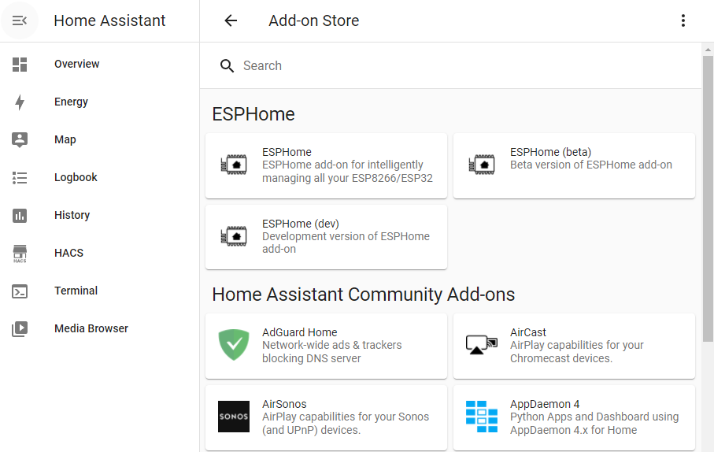

6. Now you are in ESPHome(dev) Add-on page, click on :guilabel:`Install` button to install it.

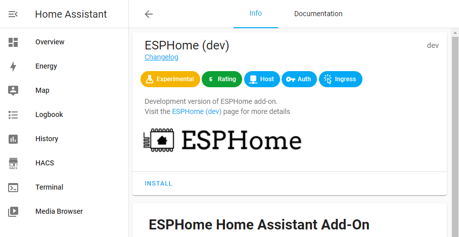

7. After installation, you can see the :guilabel:`Start` button. Click on it to start the ESPHome. There also a :guilabel:`Show in sidebar` option you can turn on to stick ESPHome on the side bar for easy access.

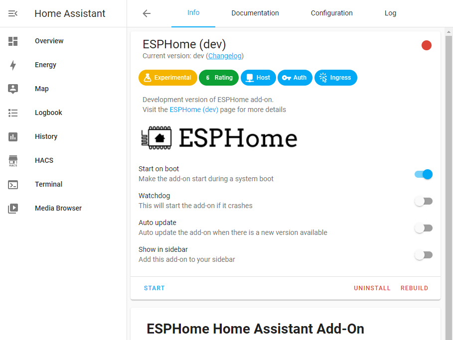

8. After ESPHome is started, click on :guilabel:`OPEN WEB UI` button to open the web UI. If everything go well, you are now at ESPHome page.

.. note::
  This may failed if you click a little too quick. as it need some time to actually start. if it goes wrong, you can try again. If it still failed, click on the :guilabel:`Log` tab on top to see the error, and maybe search it on the internet or issue on GitHub: https://github.com/esphome/issue. 

Setup Sense Node C3
--------------------
1. Now to add your sense node C3, click on the :guilabel:`NEW DEVICE` button. Type in the name you want it to be, like "living-room-pir" or someting. It will prompt you to input the Wi-Fi SSID and password the first time. This will save in your ESPHome SECRETS settings for all boards. So type in your Wi-Fi SSID and password and click on :guilabel:`NEXT` button.

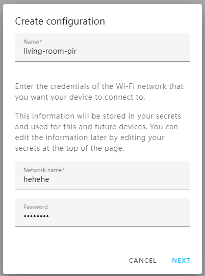

2. Then, choose ESP32 and click on :guilabel:`NEXT` button.

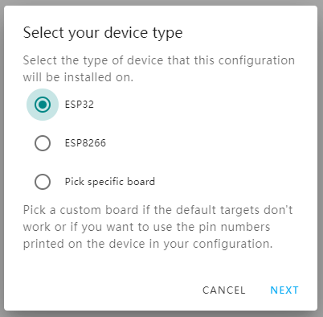

3. It's done! Click :guilabel:`SKIP` as it need more configurations.

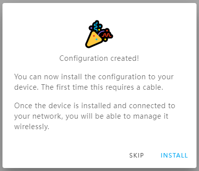

4. Now you can see the device on the main page. Click on :guilabel:`EDIT`.

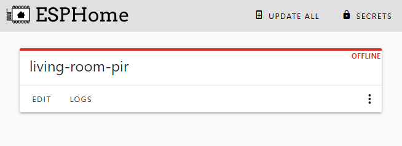

5. You can see the YAML file with the basic configuration. Replace `esphome:` and `esp32:` with the following line, remember to change the name back:

.. code-block:: yaml

  esphome:
    name: your-device-name
    platformio_options: 
    board_build.arduino.upstream_packages: []
    platform_packages:
      - framework-arduinoespressif32 @ https://github.com/espressif/arduino-esp32.git#2.0.1
    platform:
      - https://github.com/platformio/platform-espressif32.git#feature/arduino-upstream

  esp32:
    board: esp32-c3-devkitm-1
    variant: ESP32C3
    framework:
    type: arduino

6. Now add the neopixel light to see if it works. Add the following line at the bottom, remember to change the name if you want to

.. code-block:: yaml

  light:
    - platform: neopixelbus
    type: GRB
    variant: WS2812
    pin: 8
    num_leds: 1
    name: "Sense Node Status"

7. Click on :guilabel:`INSTALL` it will save automatically. The first time uploading the firmware, you need to use a USB cable to connect to the board with the Raspberry Pi or a computer your HA is installed on.

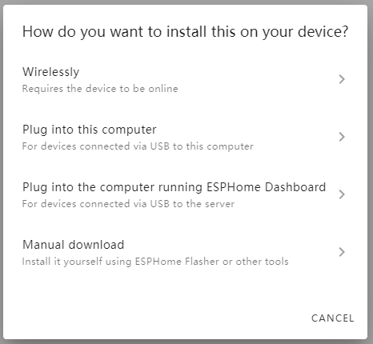

8. And choose the third option, and then choose the coresponding port, which is usually :guilabel:`USB JTAG/serial debug unit`

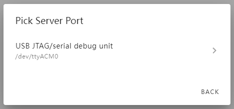

.. note::
  If it says **No serial devices found**, try again or check :ref:`faq:no-serial-device-found`.

9. Wait a while for the firmware to be uploaded.

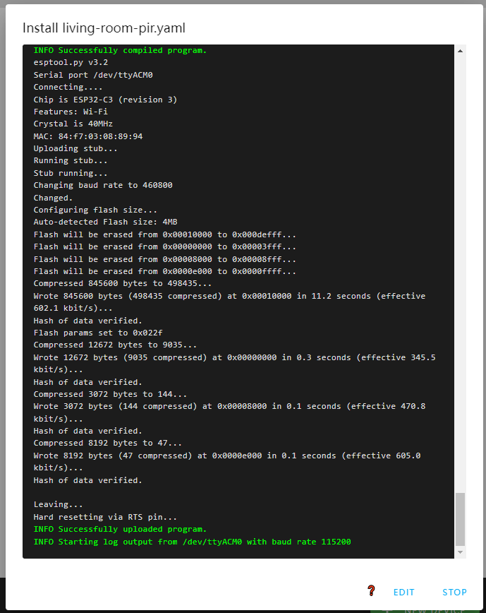

10. Now click :guilabel:`Configuration` on the left sidebar, and then :guilabel:`Device & Services`

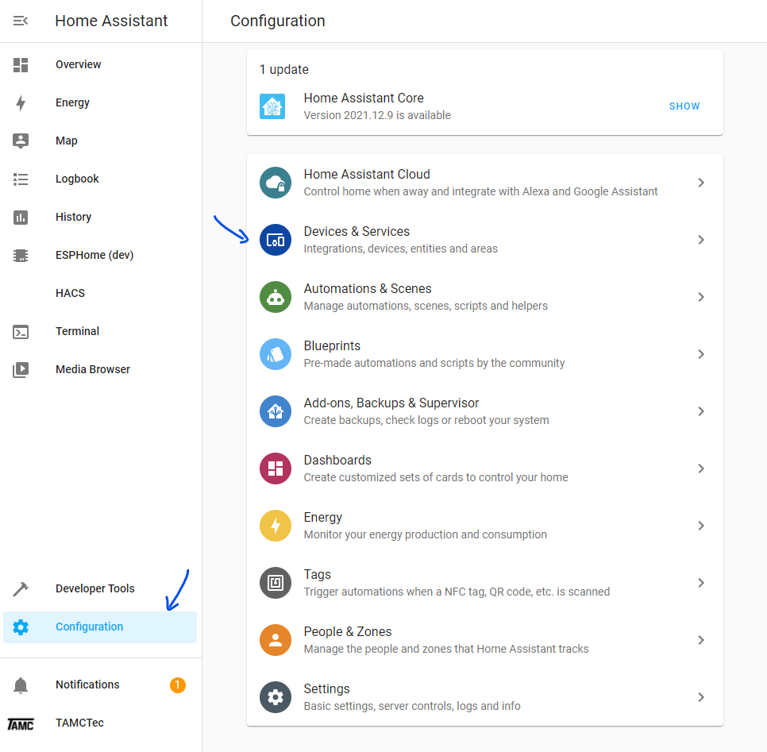

11. A new device should come up, click :guilabel:`CONFIGURE` to add it to Home Assistant.

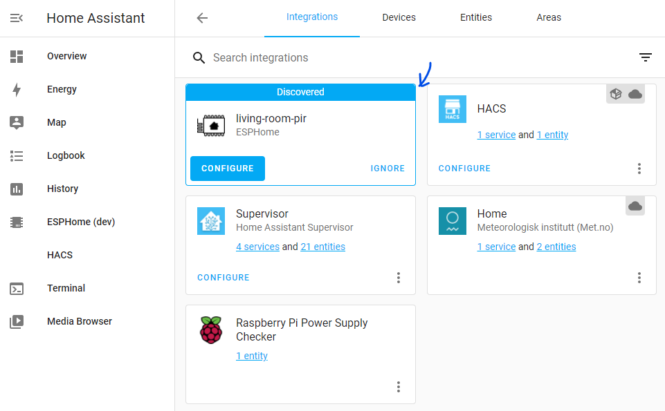

12. Now your device is added! Go to Overview page, you should see it! If not, add it manually. And try to turn it on and off to see if it works.

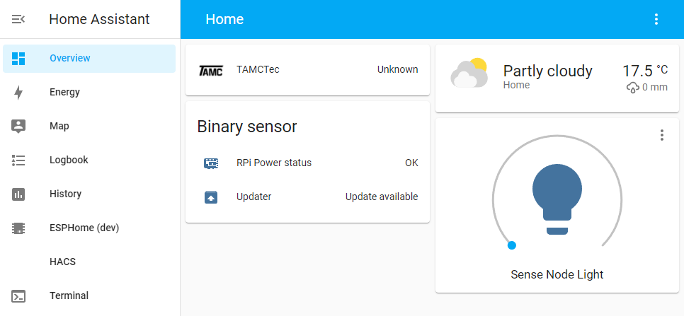

Add a battery indicator and a sensor
--------------------
Now is time to add a sensor to the sense node. ESPHome is capable for a lot of sensors, here we are going to add a PIR sensor as an example. For more information, please refer to the `ESPHome <https://esphome.io/index.html>`__

1. Go to ESPHome(dev) again. If you have add it to the sidebar, just click on it. Or, go through the :guilabel:`Configuration` => :guilabel:`Add-ons, Backups & Supervisor` and click on :guilabel:`ESPHome` => :guilabel:`OPEN WEB UI`.
2. On ESPHome page, click on edit under your device.
3. Now in the yaml editor, add the following line to the bottom:

.. code-block:: yaml
  sensor:
    - platform: adc
      pin: 0
      name: "Sense Node Battery Voltage"
      attenuation: 11db
      update_interval: 1s
      filters:
        - multiply: 2

  binary_sensor:
    - platform: gpio
      pin: 7
      name: "Sense Node PIR"
      device_class: motion

4. Click the bottom right :guilabel:`INSTALL` button. Now maybe you can upload the code wirelessly, If it shows your device as :guilabel:`ONLINE`, choose the first option :guilabel:`Wirelessly`. But mine never shows :guilabel:`ONLINE` even it works great on :guilabel:`Overview` page. If so, install it like before.
5. After installation is done, you can now add a battery voltage log and the sensor state to :guilabel:`Overview` page.

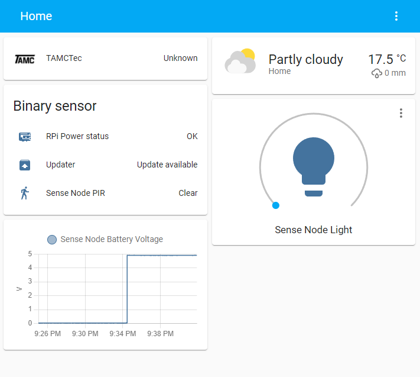
