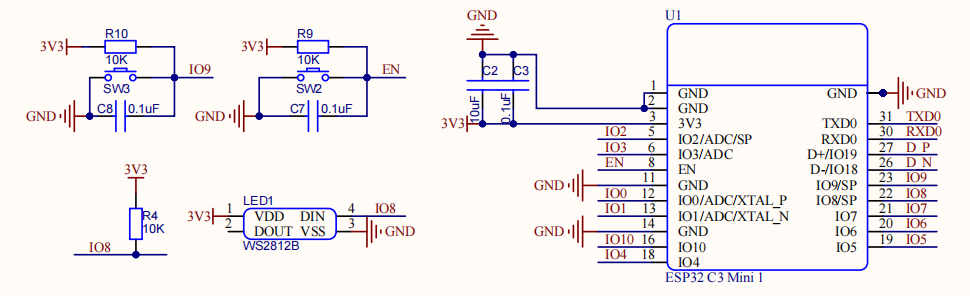
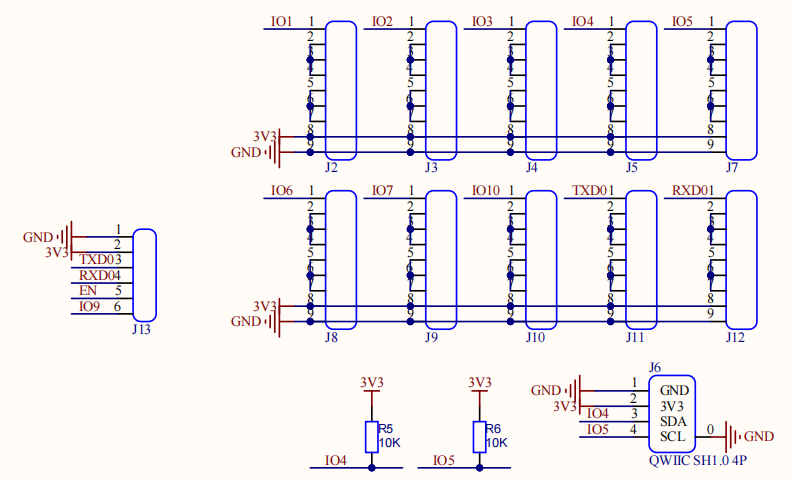

.. _hardware:

Hardware
====================================

The hardware of Sense Node C3 is simple, with mainly 3 part. ESP32 C3, Power management and sensor connectors.

Pin Assignment
------------------------------------

.. table
    :widths: 20, 30
    :align: left
  
    +-----------+---------------+
    | ESP32 C3  | Component     |
    +===========+===============+
    | GPIO0     | Battery Level |
    +-----------+---------------+
    | GPIO8     | WS2812B       |
    +-----------+---------------+
    | GPIO9     | Button        |
    +-----------+---------------+
    | GPIO4     | QWIIC SDA     |
    +-----------+---------------+
    | GPIO5     | QWIIC SCL     |
    +-----------+---------------+
    | OTHERS    | Proto Area    |
    +-----------+---------------+

Power management
----------------

Power includes 2 inputs: 5V USB Type C and 3 AAA batteries, joined together with a simple power selector, which cuts of the batteries when USB is pluged in. A 3.3V power indicator LED(D2) to indicate the power status. A 50:50 voltage divider to devide the battery voltage to IO0.

ESP32 C3
----------------

Simple setup for ESP32 C3 with WS2812B(IO8) and buttons(IO9 and EN).

Sensor connectors
----------------

Sensor connectors consist of Proto Area, QWIIC connector and UART flash connector.

Proto Area
----------------

Proto Area is a small area on the top of the Sense Node C3, like a little bread board. the pin holes are connected as the silk screen printed for easy wiring. DONOT CONNECT THE 3V3 AND GND TOGETHER!
